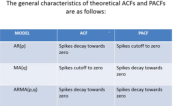

## IDENTIFICATION OF STATIONARY MODELS ARMA(p,q)

Data comes from BEA (Bureau of Economic Analysis, USA). It refers to National data on Investment (Table 5.3.1. Percent Change From Preceding Period in Real Private Fixed Investment by Type) 

URL: www.bea.gov  > Tools > Interactive Data > Section 5 - Saving and Investment >  Table 5.3.1. Percent Change From Preceding Period in Real Private Fixed Investment by Type

```{r}
serT=ts(read.csv2("investment.csv"),start=1985,freq=4)

```

### **Objective:** Given the following plots of stationary time series and corresponding ACf and PACFs, identify plausible ARMA models (pure AR, pure MA or ARMA).

<div style="text-align: center; font-size: 30px; font-weight: bold;">
  Identification step!
</div>


<div style="text-align: center;">
  {width=30%}
</div>

```{r}
ser=window(serT,start=1985)

for (i in 1:31){
  seri=ser[,i]
  
  par(mfrow=c(1,1))
  plot(seri,main=colnames(ser)[i])
  abline(h=0)

  par(mfrow=c(1,2))
  acf(seri,ylim=c(-1,1),lag.max=48,lwd=2,main=colnames(ser)[i],na.action=na.pass)
  pacf(seri,ylim=c(-1,1),lag.max=48,lwd=2,main=colnames(ser)[i],na.action=na.pass)
}
```