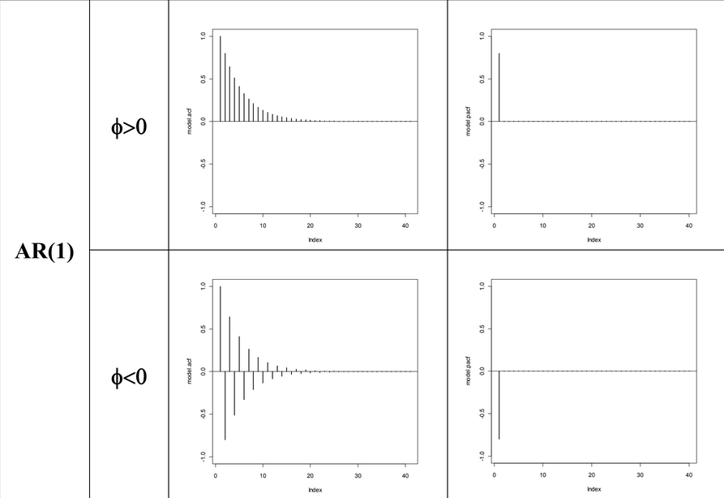
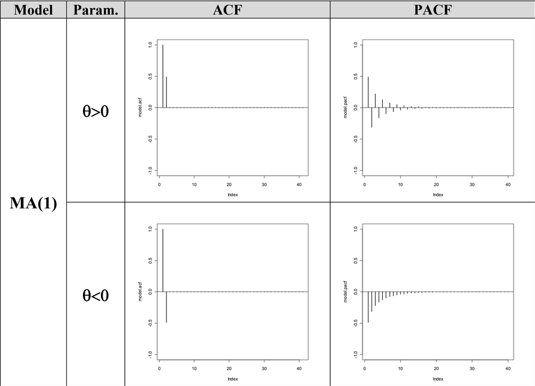
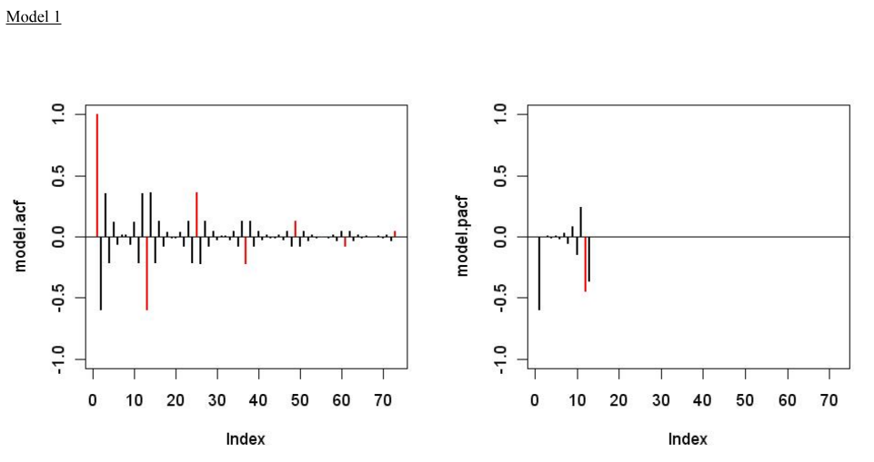
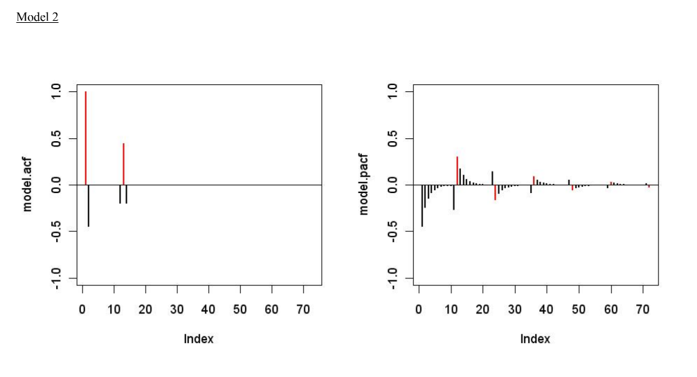
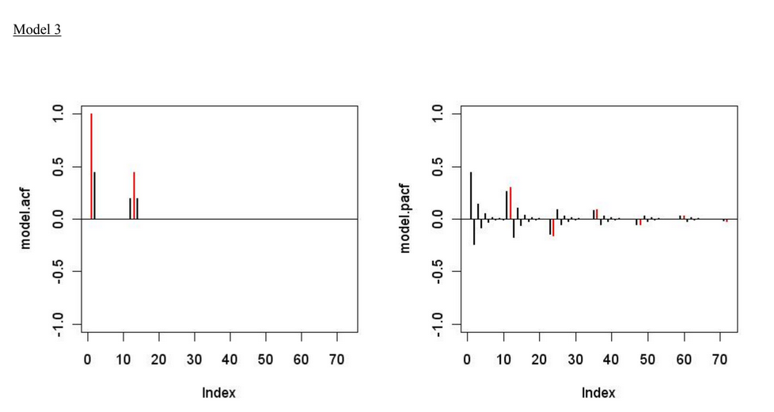
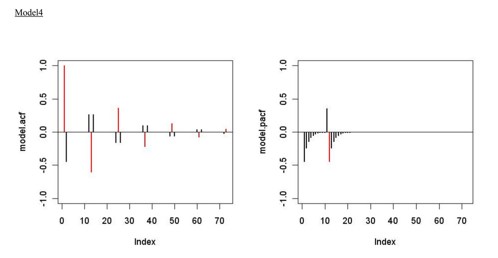
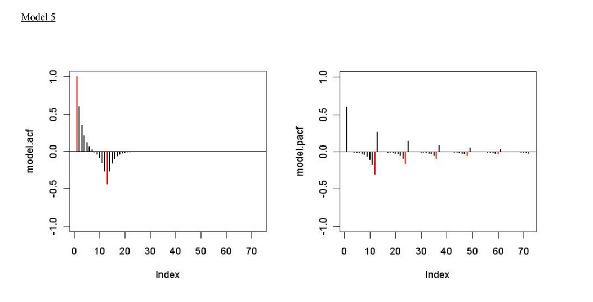
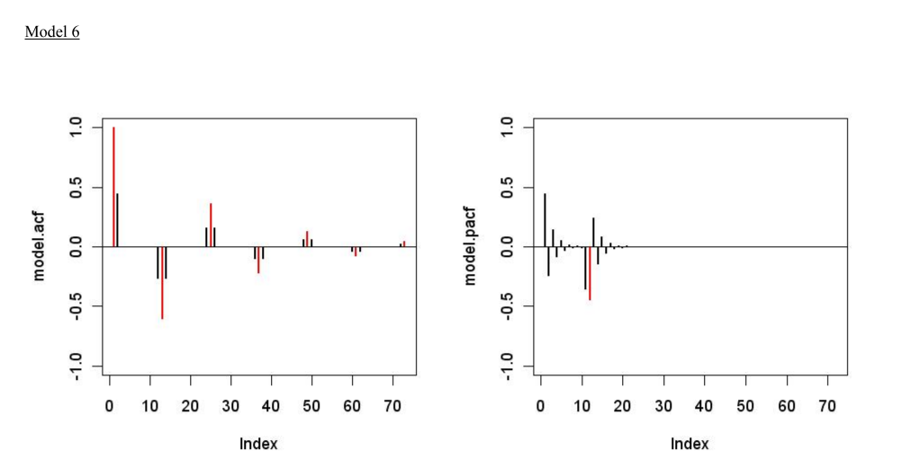
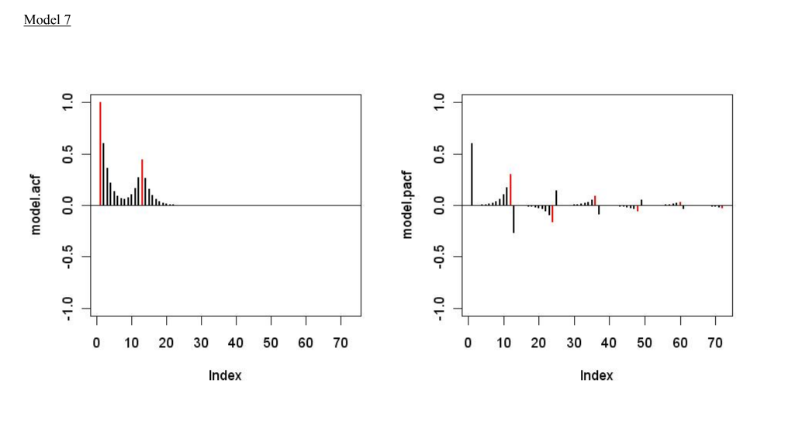

This is a handout to help practice with identifying $ARMA(p,q)(P,Q)_s$ models, as well as some bonus questions working on solving for invertability & stationarity analytically.

# Part 1: Identifying Seasonal Models

## Assigment

**Goal**: for each model, decide which is the corresponding model and the values of the parameters.

The following ACF and PACF belong to models $ARMA(p,q)(P,Q)_{12}$ of this form:

$$
(1-\phi L)(1-\Phi L^{12})X_t = (1-\theta L)(1-\Theta L^{12})Z_t \\
\phi, \Phi, \theta, \Theta \in \{-0.6, 0, 0.6\}
$$

## Reference Table: AR(1) & MA(1)

::: {layout-nrow=2}

:::

## Model 1

**SOLUTION**:
Based on our reference table, this model likely takes the form:

$$
\begin{matrix}
P = 1 & Q = 0 \\
p = 1 & q = 0
\end{matrix}
$$

Giving us the form: $ARMA(1,0)(1,0)_{12}$. The parameters take on the values:

$$
\begin{matrix}
\phi = -0.6& \Phi = -0.6\\
\theta = 0 & \Theta = 0
\end{matrix}
$$

Giving us a final model form of: $(1+0.6L)(1+0.6L^{12})X_t=Z_t$

## Model 2

**SOLUTION**:
Based on our reference table, this model likely takes the form:

$$
\begin{matrix}
P = 0 & Q = 1 \\
p = 0 & q = 1
\end{matrix}
$$

Giving us the form: $ARMA(0,1)(0,1)_{12}$. The parameters take on the values:

$$
\begin{matrix}
\phi = 0& \Phi = 0\\
\theta = -0.6 & \Theta = 0.6
\end{matrix}
$$

Giving us a final model form of: $X_t=(1-0.6L)(1+0.6L^{12})Z_t$

## Model 3

**SOLUTION**:

Based on our reference table, this model likely takes the form:

$$
\begin{matrix}
P = 0 & Q = 1 \\
p = 0 & q = 1
\end{matrix}
$$

Giving us the form: $ARMA(0,1)(0,1)_{12}$. The parameters take on the values:

$$
\begin{matrix}
\phi = 0 & \Phi = 0 \\
\theta = 0.6 & \Theta = 0.6
\end{matrix}
$$

Giving us a final model form of: $X_t=(1+0.6L)(1+0.6L^{12})Z_t$

## Model 4

**SOLUTION**:
Based on our reference table, this model likely takes the form:

$$
\begin{matrix}
P = 1 & Q = 0 \\
p = 1 & q = 1
\end{matrix}
$$

Giving us the form: $ARMA(1,1)(1,0)_{12}$. The parameters take on the values:

$$
\begin{matrix}
\phi = -0.6 & \Phi = 0.6\\
\theta = -0.6 & \Theta = 0
\end{matrix}
$$

Giving us a final model form of: $(1+0.6L)(1-0.6L^{12})X_t=(1-0.6L)Z_t$

## Model 5

**SOLUTION**:
Based on our reference table, this model likely takes the form:

$$
\begin{matrix}
P = 0 & Q = 1 \\
p = 1 & q = 1
\end{matrix}
$$

Giving us the form: $ARMA(1,1)(0,1)_{12}$. The parameters take on the values:

$$
\begin{matrix}
\phi = 0.6 & \Phi = 0\\
\theta = 0.6 & \Theta = -0.6
\end{matrix}
$$

Giving us a final model form of: $(1-0.6L)X_t=(1+0.6L)(1-0.6L^{12})Z_t$

## Model 6

**SOLUTION**:
Based on our reference table, this model likely takes the form:

$$
\begin{matrix}
P = 1 & Q = 0 \\
p = 1 & q = 1
\end{matrix}
$$

Giving us the form: $ARMA(1,1)(1,0)_{12}$. The parameters take on the values:

$$
\begin{matrix}
\phi = 0.6 & \Phi = 0.6\\
\theta = 0.6 & \Theta = 0
\end{matrix}
$$

Giving us a final model form of: $(1-0.6L)(1-0.6L^{12})X_t=(1-0.6L)Z_t$

## Model 7

**SOLUTION**:
Based on our reference table, this model likely takes the form:

$$
\begin{matrix}
P = 0 & Q = 1 \\
p = 1 & q = 1
\end{matrix}
$$

Giving us the form: $ARMA(1,1)(0,1)_{12}$. The parameters take on the values:

$$
\begin{matrix}
\phi = 0.6& \Phi = 0 \\
\theta = 0.6 & \Theta = 0.6
\end{matrix}
$$

Giving us a final model form of: $(1-0.6L)X_t=(1+0.6L)(1+0.6L^{12})Z_t$

# Part 2: Invertability & Causality

